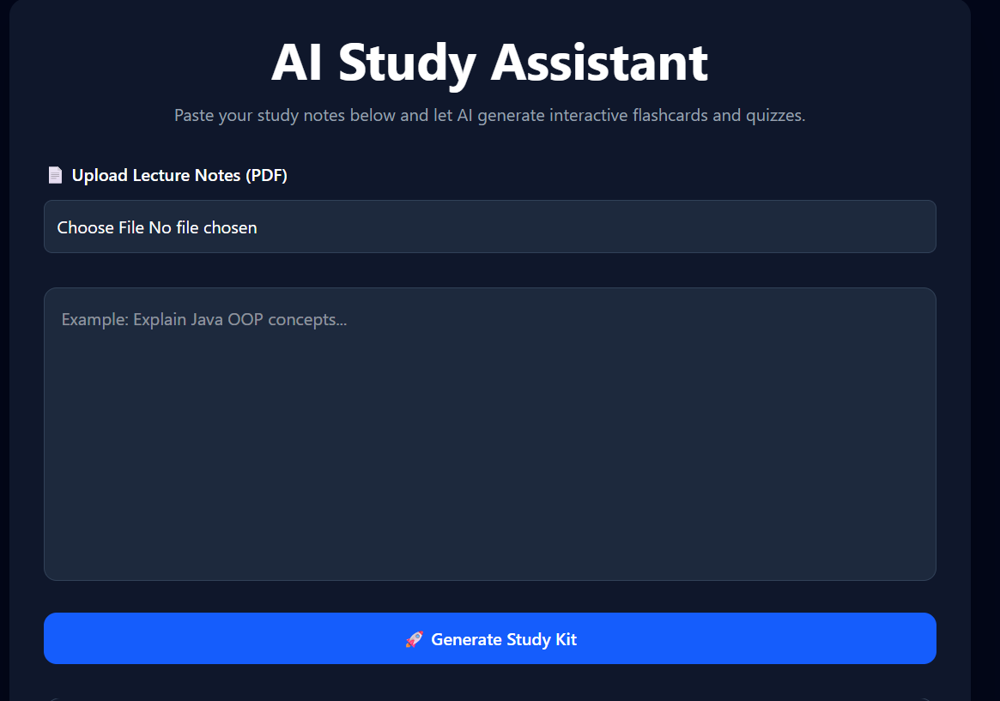
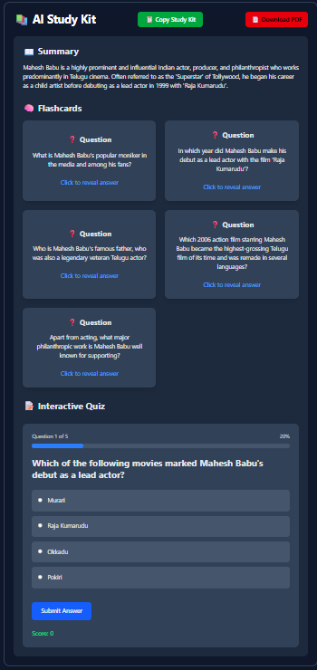
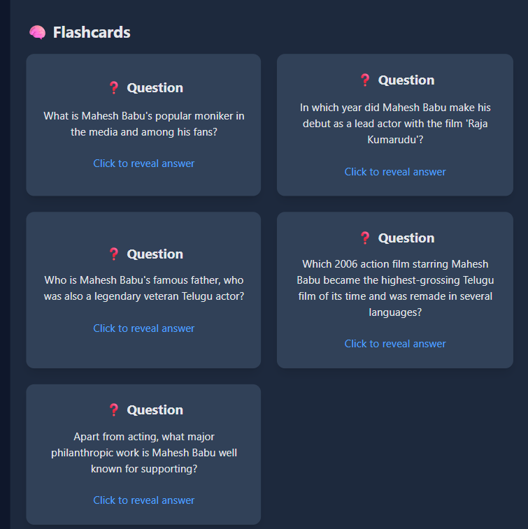
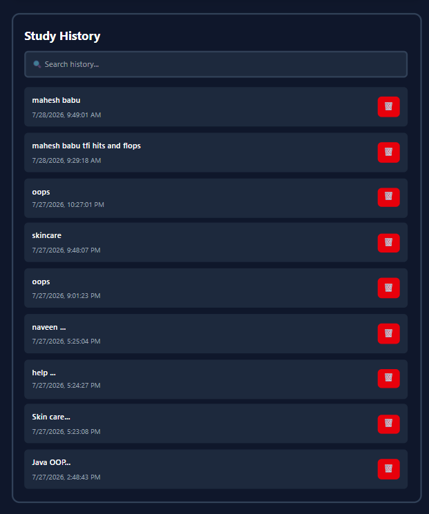

# 📚 AI Study Assistant

An AI-powered full-stack web application that transforms study notes into concise summaries, interactive flashcards, and quizzes using Google Gemini AI. Users can upload PDF lecture notes, generate study material instantly, and save previous study sessions.

---


## 🚀 Live Demo

**Frontend:** https://ai-study-assistant-five-rouge.vercel.app

**Backend API:** https://ai-study-assistant-8ogw.onrender.com

---

## ✨ Features

- 🤖 AI-generated study summaries
- 🧠 AI-generated flashcards
- 📝 Interactive multiple-choice quizzes
- 📄 PDF lecture notes upload
- 📥 Download study kit as PDF
- 📋 Copy study kit to clipboard
- 🕘 Study history with search
- 🗑️ Delete study history
- 💾 Local storage persistence
- ⏳ Loading spinner
- 🔔 Toast notifications
- 🔄 Retry logic for AI requests
- ❌ Robust error handling

---

## 🛠️ Tech Stack

### Frontend

- React
- Vite
- Tailwind CSS
- React Icons
- React Toastify

### Backend

- Node.js
- Express.js

### AI

- Google Gemini API

### Libraries

- jsPDF
- pdf.js

---

## 📂 Project Structure

```text
ai-study-assistant/
│
├── src/
│   ├── components/
│   ├── pages/
│   ├── utils/
│   └── App.jsx
│
├── server/
│   ├── index.js
│   ├── package.json
│   └── .env
│
├── public/
└── README.md
```

---

## 📸 Screenshots

### 🏠 Home Page



### 📚 Generated Study Kit



### 🧠 Flashcards



### 📝 Interactive Quiz


### 🕘 Study History



## ⚙️ Installation

### Clone the repository

```bash
git clone https://github.com/srikanthP1106/ai-study-assistant.git
```

### Navigate to the project

```bash
cd ai-study-assistant
```

### Install frontend dependencies

```bash
npm install
```

### Install backend dependencies

```bash
cd server
npm install
```

### Create a `.env` file inside the `server` folder

```env
GEMINI_API_KEY=YOUR_API_KEY
```

### Start the backend

```bash
cd server
npm start
```

### Start the frontend

```bash
npm run dev
```

---

## 💡 Future Improvements

- User authentication
- Cloud database integration
- AI difficulty levels
- Dark/Light mode
- Multiple AI model support
- Share study kits
- Voice-based study mode

---

## 👨‍💻 Author

**Srikanth Paruchuri**

- GitHub: https://github.com/srikanthP1106

---

## 📄 License

This project is licensed under the MIT License.